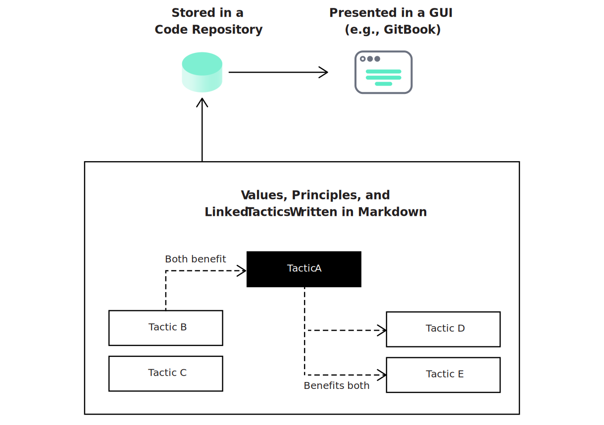

# A Living Handbook

The Lean Design System methodology prioritizes experimentation over documentation and advocates a lightweight approach to written guidelines, at least during the early stages of building a design system. A lot of information can be stored and maintained as comments within our [UI Kit](ui-kits.md) or [Design Tokens](design-tokens.md) code; however, we will probably still need some form of knowledge hub alongside our component repositories, where we outline the structure and scope of our design system and write down the principles, norms, and workflows that guide our work. Such supporting documentation should be simple, brief, and precise and stored in a collaborative format, like a markdown repository, a cloud spreadsheet, or a wiki. It should include the following elements:

* **Scope:** We reference all elements that we consider to be part of our design system and specify where they're maintained, as well as the workflows around them.
* **Integrations**: We reference all 3rd party frameworks and resources we're utilizing, explain how they're integrated and what we need to keep in mind in order to use them as intended.
* **Technical setup:** If applicable, we explain development environments and technical setups like Gulp automations or how to trigger build pipelines. Here we may also specify our currently preferred design tooling and code guidelines.
* **Mission:** We articulate a design system mission statement outlining the norms and values that guide our work, making our implicit practices explicit.

Through the process of articulating thoughts we can clarify ideas, avoid misunderstandings and explain abstract concepts—especially if done collaboratively and cross-functionally. We don’t have to make a document perfect before sharing it—we make it good enough to convey our ideas and then improve it in a collaborative fashion.

The Lean Design System documentation is freely available under a Creative Commons license \(no attribution\) and can serve as a foundation for a lightweight design system documentation. It is written in markdown language and stored in a Git repository, which makes it easy to fork, customize and extend. Individual parts can be adopted without change, edited as needed, or deleted altogether. The diagram below \(fig. 1\) illustrates the structure of the documentation: 

A codified documentation as outlined here, where information is stored in a repository alongside other codified design components, is a good starting point for a fully automated documentation with live component previews down the road.

## Where this tactic fits in



Minimum Viable Design System provides a helpful frame of reference for establishing A Living Handbook.





A Living Handbook can serve as a starting point for establishing our design system.





#### Authors and contributors

D. Kurfess

