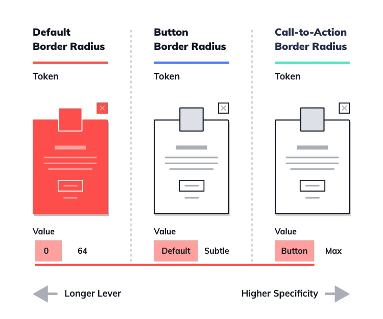

# Design Tokens

[Design Codification](../principles/design-codification.md) represents one of the fundamental principles of Lean Design System, as it enables cross-functional teams to work collaboratively and adopt collective ownership of a design system. However, planning and implementing a comprehensive component library can prove a substantial challenge, even for experienced teams. Taking incremental steps towards this goal will help us get started, especially if we're new to concepts such as design-as-code and radical cross-functionality \(as proposed in [Win Friends, not Battles](../principles/win-friends-not-battles.md)\). Maintaining design aspects in the form of Design Tokens makes for one such approach. According to design system advocate [Jina Anne](https://twitter.com/jina) \(who is also co-chairing the W3C's [Design Tokens Community Group](https://www.w3.org/groups/cg/design-tokens)\):



Design Tokens can be described as an abstraction of all aspects shaping the design of digital products. In contrast to hard-coded values maintained all over the place, tokens are the central roots of a scalable and consistent design system.

A well-thought-out Design Tokens structure constitutes the bedrock of a lean code repository. It provides the DNA for our components and a shared language between domains. A design system based on Design Tokens forces designers and developers to continually form consensus, promoting a healthy interweaving of skills and responsibilities. Designers are encouraged to gain at least a basic understanding of the code in order to define and approve tokens. Front-end developers learn about the purpose behind design-related decisions and the relationship between properties, as Design Tokens manage to bridge the semantic gap between the designers' intentions and the technical implementation. They provide additional richness to design definitions and make technical and stylistic nuances more tangible to both audiences.

Design tokens also provide designers and developers with powerful levers to make changes quickly and effectively throughout all layers of the design system and our front-end implementations. These layers include the brand design properties at the core of the design system, higher-level themes, custom adaptations, and the specific UI component mappings on the surface of a digital product. The following examples will illustrate how we can structure a Design Tokens repository to make full use of the concept.


The currently preferred approach to maintaining Design Tokens is storing them in a JSON file, as it's the most widely supported format. From there, all information can be pulled directly via JavaScript or compiled to CSS. The examples below are written in SCSS to make them easier to read for designers who may be unfamiliar with JSON.


First, we take a look at colors. More specifically, we will learn how a color definition is passed through the semantic layers of a Design Tokens structure—all the way from the most abstract level of the color palette to the tangible level of a UI mapping. Subsequently, we apply the same idea to border radii. Similarly, we start with an abstract, subatomic definition and specify increasingly semantic mappings. Now let's see what the corresponding SCSS would look like—switch between the two tabs to check out both examples:



```css
/****
* 1 Subatomic definitions: Our color palette 
****/

$cornflower: #5784FF; 
/* We assign a value to a new color in our color palette */


/****
* 2 Getting more specific: Our color scheme 
****/

$primary-color: $cornflower;
/* On the next level, we assign the value cornflower to our primary color */


/****
* 3 UI mapping: Mapping sub-atomic defintions to UI components 
****/

$color-btn-cta: $primary-color;
/* In the last step, our primary color is assigend to the cta button */
```



```css
/****
* 1 Subatomic definitions: All border radius values
****/

$border-radius-xxs: 0; 
/* We set the smallest possible border radius value to 0 */


/****
* 2 Getting more specific: Specifying our default radius
****/

$border-radius-default: $border-radius-xxs;
/* We're going for a blocky look and map the smallest radius our default */


/****
* 3 UI mapping: Specifying button border radius
****/

$border-radius-button: $border-radius-default;
/* Next, we assign our default radius to all button elements */


/****
* 4 More specific UI mapping: Specifying cta button border radius
****/

$border-radius-button-cta: $border-radius-button;
/* Lastly, we assign the button border radius to our cta buttons as well */
```



The following animation \(fig. 1\) illustrates how we can now make changes on various levels of our design system with ease. The three columns represent three individual design tokens and show how each of them affects the rendering of a simplified profile card component. \(The animation is based on Example 2 but skips the first layer for clarity.\) By changing the value for our default border-radius \(red\), we substantially change the look of our UI, as several higher-level tokens all reference the same root token. The lever gets shorter with each level, as we can see in the second column: Changing the button border-radius \(blue\) only affects the rendering of the two buttons in our example. And lastly, changing the call-to-action button border-radius—unsurprisingly—manipulates nothing but the one call-to-action button element.



A structure as outlined above will not only prove more human-readable—it also provides us with levers to make changes through all layers of our design system without doing unintentional harm. And the way we map abstract values to tangible attributes creates semantic guardrails, making a design system based on Design Tokens self-governing to a certain degree. I.e., as a developer, I wouldn't just assign a color called _"button color"_ to a text paragraph and instead, highlight a potential gap in the Design Tokens repository if the proper token appears to be missing.

> The way we map abstract values to tangible attributes creates semantic guardrails, making a design system based on Design Tokens self-governing to a certain degree.

With the help of Design Tokens, we can genuinely embrace cross-functionality and collective ownership. Furthermore, they enable many other powerful concepts, such as [A Steady Flow Truth](../infrastructure/steady-flow-of-truth.md) and a flexible front-end architecture as outlined in [On the Shoulders of Giants](../infrastructure/on-the-shoulders-of-giants.md).

## Where this tactic fits in



Gradually and naturally evolving the structures of an emergent design system may lead to clutter. Tidy up! guides the way to continuous improvement and an optimal design.





Design Tokens are a good way to get started with Design Codification and allow for a gradual approach to codifying style definitions and adopting collective ownership.



Design Tokens provide ways to keep the interfaces between our technical implementations clean and simple.



Design Tokens represent a key concept for enabling a smooth flow of optimization through our repositories.



Especially the ideas of collective ownership and cross-functional collaboration benefit greatly from using Design Tokens.





#### Authors and contributors

D. Kurfess

