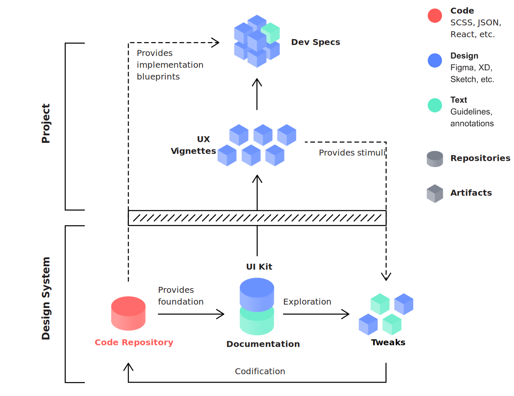

# UI Kit

When we analyze the visual anatomy of today's most popular apps, we can observe a very high degree of consistency, making them feel polished, easy to navigate, and generally pleasant to interact with. Besides the consistent use of typography and color, we might find that the same paddings are applied to cards, forms, and menus, that the proportions of modules are affected similarly by viewport changes, and that animations all follow the same set of rules. To ensure the correct application of patterns and attributes defined by an underlying design language, digital product teams use central component libraries for their design work. Typically, these libraries contain modular building blocks, plus all relevant guidelines specifying nesting and recombination options. Increasingly, these libraries are referred to as UI Kits and are maintained in modern design tools such as Figma, Adobe XD, or Sketch.

## The UI Kit in the context of Lean Design System

The UI Kit is a powerful tool and in the context of Lean Design System methodology, it plays a vital role for communication, exploration, and prototyping. If we decide to adopt Design Codification and 

Once and only once

Atomic Design, required reading

Kept clean, free of redundancies and .. See tidy up

Very often, a UI Kit maintained in a modern design tool such as Figma, Adobe XD, or Sketch represents the first step for teams and organizations towards building a design system. The consolidation of components in one central place 

Atomic Design.

Our UI Kit lives in a modern UI design tool such as Figma, Adobe XD or Sketch. While some of these tools provide ways to generate code automatically, the corresponding workflows can make us too dependent on a specific tool or framework. Also, the code quality may not be up to scratch, as there are semantic gaps that still prove hard to bridge from this side of the handoff process. Instead, Lean Design System promotes the adoption of Design Tokens as a much more effective and fluent approach to the integration of design and development efforts. For that reason \(and as we can see in fig. 1\), the UI Kit should always be based on the latest definitions in our code repository. In other words, we quite literally trace components exactly as they are rendered on devices and make them available as design components within our UI Kit. What may seem a bit cumbersome at first will ensure that the UI Kit never takes the lead over the code repository. A component that can't be easily built using our technology should not be part of our UI Kit. This way, prototypes we design will always be close to the real thing and all testing we perform will be valid. We should always only have one central and shared UI Kit file \(or file structure in the case of a very large or complex component library\).

## Where this tactic fits in



Diligently refactoring our design system artifacts will prevent our repositories from cluttering.





Building a UI Kit will train our systems thinking capabilities.





#### Authors and contributors

D. Kurfess

