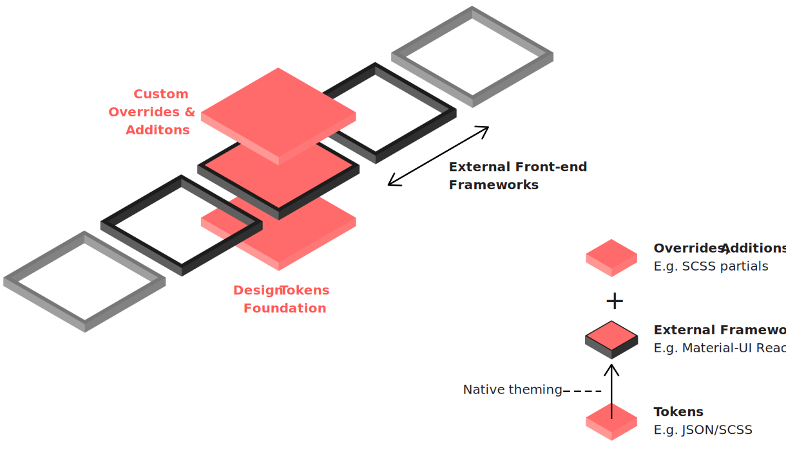
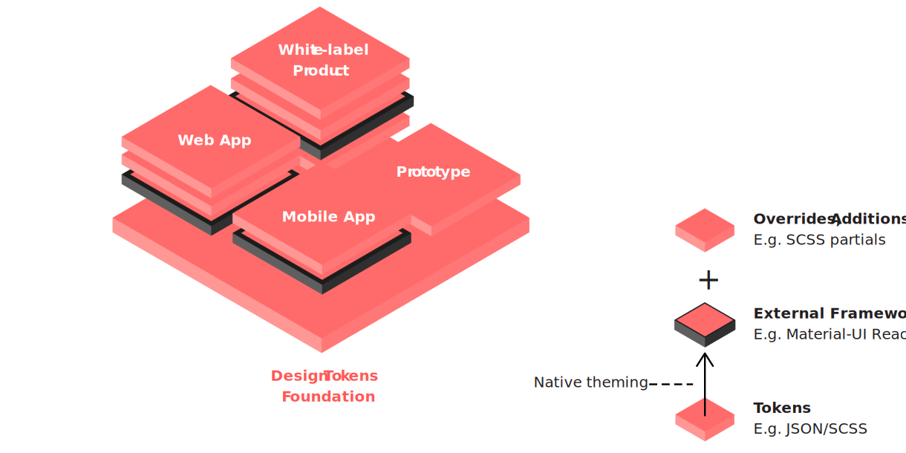

# On the Shoulders of Giants

[Minimum Viable Design System](../principles/minimum-viable-design-system.md) promotes the systematic exploitation of external resources in order to make a design system and its components usable as soon as possible. Depending on our specific requirements and goals, such resources might include all kinds of open source projects, modern front-end frameworks, or asset libraries \(icon sets, font families, etc.\). However, relying heavily on a resource that is not under our control exposes us to various risks that need to be addressed. The dependency on a specific resource can severely compromise our flexibility. We're at the mercy of external teams when it comes to future developments.

On the Shoulders of Giants proposes guidelines on a sustainable approach to utilizing external resources—with the goal to minimize potential risks and maximize the benefits.  
  
them potentially exposes us to several risks we need to undersand and consider

Can make us overly dependent on things out of our control and cost us flexibility

If we zoom out a little and , we can see that such an architecture can work for a diverse product portfolio and different implementations can all draw from the same design tokens foundation—so long as we keep our interfaces clean and simple and utilize the provided theming capabilities as they were intended. This is an extremely powerful paradigm that even allows us to explore different approaches for different platforms.

