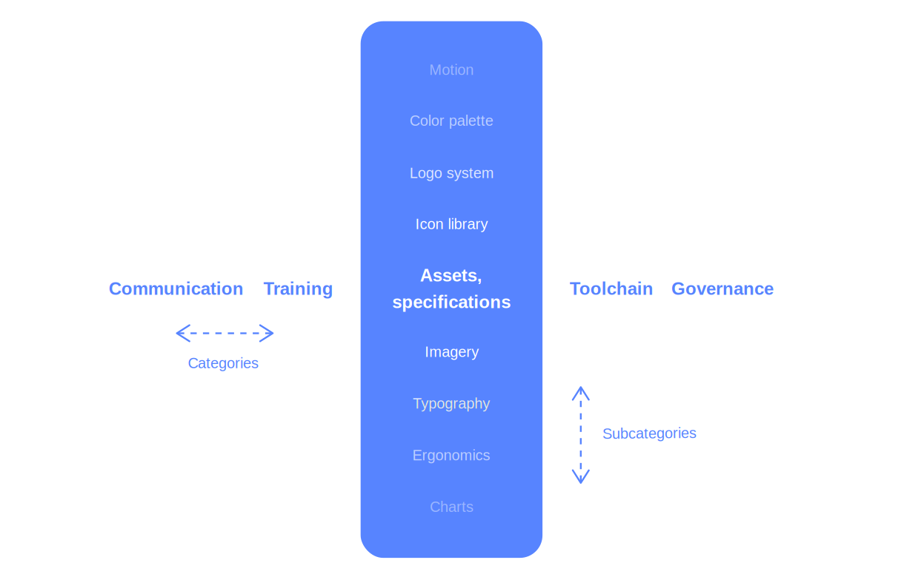

# Minimum Viable Design System

The planning and implementation of a modern design system can easily turn into a formidable undertaking, requiring significant investments of time, capital and people. Oftentimes, the obstacles associated with it prove insurmountable for resource-constrained organizations. Furthermore, an overly monolithic approach, where months and even years are spent building extensive libraries, poses the risk of producing unfit solutions in the end. We can't predict the future and working towards uncertain outcomes may have costly consequences.

Minimum Viable Design System attempts to address these concerns and is centered around the following 3 core ideas—which also underpin the Lean Design System methodology as a whole:

* **Start today:** The best time to start cultivating a design system was the day we started working together. The second best time is now.
* **Solve today's problems:** The success of a design system isn't defined by its comprehensiveness or depth of implementation, but solely by the extent to which it helps us solve real problems and generate compelling products.
* **Validate continuously:** Building the components needed today and starting to use them immediately in prototypes and real projects will help us evaluate their fitness and make swift adjustments.

Let's have a closer look at each of the 3 ideas to learn how they make the concept of design systems more accessible and what it means to apply them in practice.

## Start today

If we're already building digital products in a team, there really isn't any reason to delay the systemization of design work. Today's digital tools and organizational paradigms allow for tremendous scalability—when leveraged to their fullest. There are many simple steps we can take today in order to start establishing our own design system, no risks involved. Lean Design System promotes the steady cultivation of design system structures along real problems, projects and experiences—and Minimum Viable Design System provides us with a helpful reference frame around the entire methodology. Tactics such as [A Name and a Place](../infrastructure/a-name-and-a-place.md), [Design Tokens,](../artifacts/design-tokens.md) and [Think Systems!](../actions/think-systems.md) can serve as suitable starting points if we decide to take the plunge.

## Solve today's problems

In order to understand and apply Minimum Viable Design System, we first need to consider the definition of design systems themselves: At what point does a collection of front-end components, UI kits, and guidelines become a design system? Lean Design System promotes a very pragmatic and straightforward interpretation: Any socio-technical system that makes our product development successes repeatable and transferable is a design system. Such a success can be design-related, but also of technical or organizational nature. What elements and components it precisely covers entirely depends on our specific problems, challenges and goals. This liberating notion allows us to focus our efforts on , and confidently draw on freely available resources in other areas.

> Any socio-technical system that makes our product development successes repeatable and transferable is a design system.

The following diagrams \(fig. 1 and fig. 2\) provide two ways to look at the structure of a design system. Fig. 1 outlines a possible anatomy of a design system

Description for Fig 2.

## Validate continuously

The Lean Design System methodology strongly values Exploration over Planning. Lorem ipsum dolor sit amet, consectetur adipiscing elit, sed do eiusmod tempor incididunt ut labore et dolore magna aliqua. Ut enim ad minim veniam, quis nostrud exercitation ullamco laboris nisi ut aliquip ex ea commodo consequat. Duis aute irure dolor in reprehenderit in voluptate velit esse cillum dolore eu fugiat nulla pariatur. Excepteur sint occaecat cupidatat non proident, sunt in culpa qui officia deserunt mollit anim id est laborum. Lorem ipsum dolor sit amet, consectetur adipiscing elit, sed do eiusmod tempor incididunt ut labore et dolore magna aliqua. Ut enim ad minim veniam, quis nostrud exercitation ullamco laboris nisi ut aliquip ex ea commodo consequat. Duis aute irure dolor in reprehenderit in voluptate velit esse cillum dolore eu fugiat nulla pariatur. Excepteur sint occaecat cupidatat non proident, sunt in culpa qui officia deserunt mollit anim id est laborum.

### Where this tactic fits in







Test Text A





