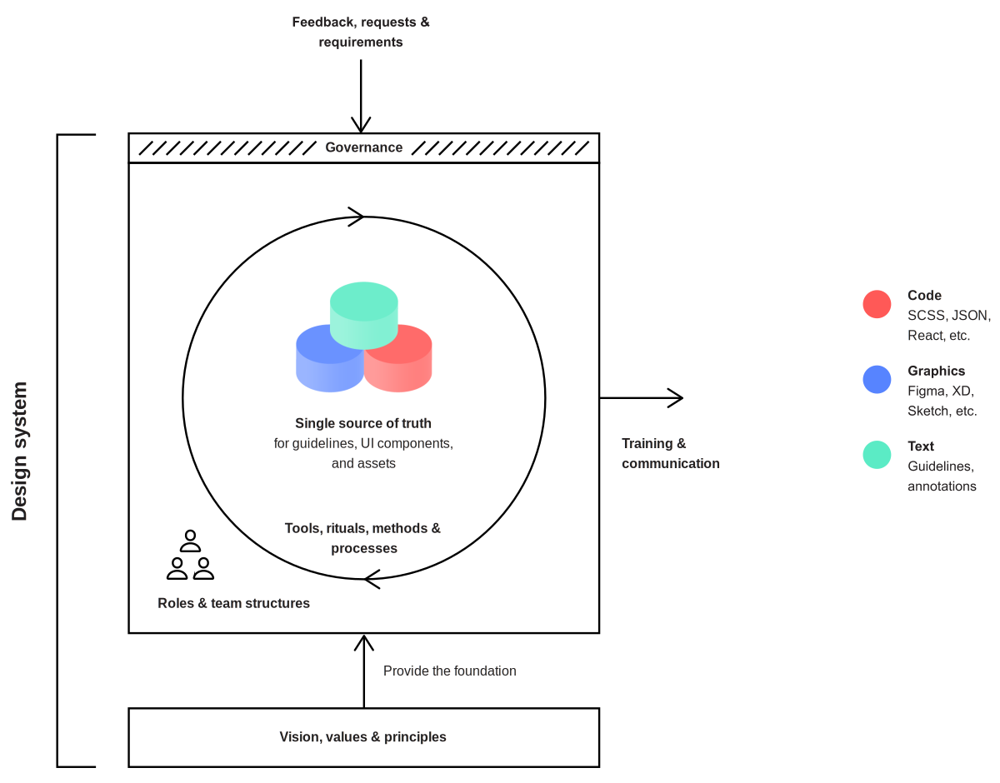

# Minimum Viable Design System

Planning, implementing and communicating a modern design system can easily turn into a formidable undertaking, requiring significant investments of time, capital and people. Often, these prove insuperable barriers to entry for resource-constrained organizations. Furthermore, poses risks to 

Minimum Viable Design System attempts to address all these concerns and is centered around the following 3 core ideas:

* **Start today:** The best time to start cultivating a design system was the day we started working as a team. The second best time is now.
* **Solve today's problems:** The success of a design system isn't defined by its comprehensiveness or depth of implementation, but solely by the extent to which it helps us solve real problems and drive forth compelling products.
* **Validate continuously:** building the components needed today and starting to use them immediately 

These ideas also underpin Lean Design System as a whole. Let's have a closer look at each of them to learn how they . [Test Link.](../actions/enable.md)

## Start today

## Solve today's problems

In order to understand and apply Minimum Viable Design System, we need to consider our own definition of the design system itself: At what point does a collection of front-end components, UI kits, and guidelines become a design system? Lean Design System promotes a very pragmatic and straightforward interpretation – _**any socio-technical system that makes our product development successes \(of technical, as well as artistic and organizational nature\) repeatable and adaptable is a design system.**_ What elements and components it covers entirely depends on our specific problems, challenges and goals.

> Every socio-technical system that makes our product development successes \(of technical, as well as artistic and organizational nature\) repeatable and adaptable is a design system.

