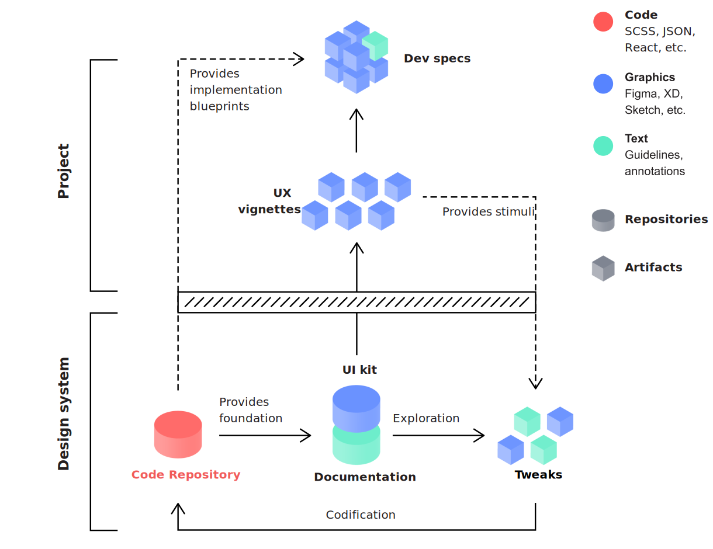

# Steady Flow of Truth

Single Source of Truth is a key concept of design systems. It is the practice of structuring information such that every individual element is stored and edited in only one place. A SSOT helps to prevent redundancies and unwanted variances and can be called upon to settle disputes. Depending on an organization's goals and background, their SSOT for design components might be a code repository, a documented set of guidelines or a comprehensive UI kit \(built and maintained in tools like Figma or Adobe XD\). Being able to rely on a Single Source of Truth in our design and development processes is essential to avoiding the accumulation of technical and design debt. 

Lean Design System proposes a more flexible approach to this concept. Instead of having one, we establish a steady flow of new components and optimizations populating our . With that, want to achieve several things:

* We want to **foster cross-functional design and development processes** to better understand our respective struggles and establish collective ownership to break up knowledge silos.
* We want to avoid confusion
* We want to **avoid building and validating unrealistic prototypes** that do not adequately reflect the actual capabilities of our technology in order to save us time and frustration.


It should be noted that Steady Flow of Truth heavily relies on [Design Codification](design-codification.md) to work as intended. If we're certain that we don't want to adopt Design Codification for our design system, we might have to make adjustments or skip this tactic altogether.


Any work we Populate ...

