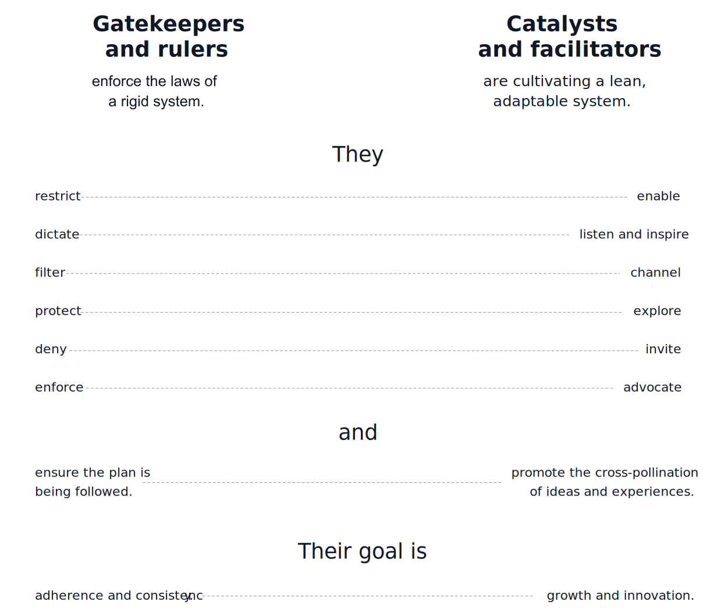

# Win Friends, not Battles

> _Any organization that designs a system will produce a design whose structure is a copy of the organization's communication structure._
>
>   __— Melvin E. Conway, ['Conway's law'](https://en.wikipedia.org/wiki/Conway%27s_law)

Whether we’re trying to [save bats](https://www.youtube.com/watch?v=_7Z7m6Fz_UA) or build design systems, winning friends will always prove a powerful strategy. Lean Design System promotes the idea of autonomous, empowered design system teams, where every individual strives to make their teammates' lifes easier and explores ways in which to optimize daily work. In the context of lean startups \(or resource-constrained organizations in general\), we can't afford to waste time on slow moving governance processes or wait for responses that got stuck in bottlenecks. We trace problems back to their source and rather pull up a \(real or virtual\) chair next to our colleagues than send an email, create a Jira issue, or even worse, tolerate the deficiency. Ideally, we always try to:

* …be catalysts of improvement
* …enable others
* …adopt and cultivate collective ownership
* …foster cross-functional collaboration

## Catalyze improvement

The [Theory of Constraints](https://en.wikipedia.org/wiki/Theory_of_constraints) teaches us that _"any improvements made anywhere besides the bottleneck are an illusion"_ \(as summarized in [The Phoenix Project](https://itrevolution.com/the-phoenix-project/)\). We try to identify any such bottlenecks through the rigorous evaluation of activities and interactions that are part of our daily work. Incremental development steps as proposed in [Minimum Viable Design System](minimum-viable-design-system.md) and [Steady Flow of Truth](../infrastructure/steady-flow-of-truth.md) allow us to reflect on our practices regularly and make adjustments as needed. This requires sufficient autonomy, however. Agile coach extraordinaire [Henrik Kniberg](https://twitter.com/henrikkniberg) wonderfully illustrates the concept of autonomous teams guided by a clear vision and principles in his video series [Spotify Engineering Culture](https://www.youtube.com/watch?v=4GK1NDTWbkY), where he also explains how the process of cross-pollination will spread successful ideas and approaches across an organization. A high autonomy, high alignment environment constitutes an ideal organizational hotbed for naturally emerging solutions. In summary, we want to foster a culture of experimentation, where curiosity is valued over defensiveness. The juxtaposition illustrated in fig. 1 attempts to outline an ideal role model for every individual involved in the development of a lively and adaptive design system.

## Enable others

Enabling others means allowing things to happen in parallel and removing bottlenecks from our processes. This may include the optimization \(or better yet: the elimination\) of handoff processes or the setup of automated pipelines which allow designers to immediately validate recent changes in a realistic setting. Wherever we look, the creation of a steady flow of work and the removal of obstacles by understanding and solving each others struggles is key to cultivate an effective design system. In this context, the principle of [Design Codification](design-codification.md) helps designers as well as developers to work more independently, while at the same time, it improves the conversation as it establishes a shared language between the two domains. 

## Adopt and cultivate collective ownership

Collective ownership means spreading the responsibility of design system components across the whole team. While, due to the diverse skill sets typically needed to build design systems, there may be certain limits to this approach, the principle of [Design Codification](design-codification.md) and especially the concept of [Design Tokens](../artifacts/design-tokens.md) will still get us quite far. By sharing ownership, we're free to make changes as needed to complete our tasks. It allows us to move at our natural pace without having to wait for others.  We can also fix issues or refactor legacy elements right as we come across them. Fully realized, adopting collective ownership of our design system components can substantially boost everyday work efficiency and catalyze the [Steady Flow of Truth](../infrastructure/steady-flow-of-truth.md) through our repositories.

## Foster cross-functional collaboration

Before the advent of design systems, traditional design-to-development handoffs \(as illustrated in fig. 1\) were the typical approach to translating design work into productive code. Working in such a manner often entailed tedious repetition, and it always carried the risk of misunderstood intentions and frustrating back-and-forths between teams.

Design systems proposed the cross-functional development of ready-to-use components and patterns organized in libraries with the goal of making product development a more continuous and better predictable affair. Larger enterprises may have the resources to employ separate teams to work on the visual design, the user experience aspects, and the technical implementations of components—a luxury most smaller organizations certainly won't be able to afford—however, Lean Design System strongly encourages cross-functional collaboration even within teams. Having at least a basic understanding of the opposite party's domain can greatly benefit the communication. The concept of Design Tokens can help gap the bridge between design and development; it can serve as a translator of our designers' intentions, as well as make the technical realities on the engineering side more tangible.

But the scope of cross-functionality goes further: Inspired by [Genchi Genbutsu](https://en.wikipedia.org/wiki/Genchi_Genbutsu), one of the key principles of the [Toyota Production System](https://en.wikipedia.org/wiki/Toyota_Production_System), Lean Design System also strongly encourages individuals working on the design system routinely joining product development projects—and vice versa. Such role swaps will prove tremendously helpful in learning about the specific challenges within the respective areas. Needless to say, this applies to designers just as well as to engineers. The project perspective is especially valuable, as we will not only learn about the struggles of applying the design system, but also about how end customers perceive the components defined in our repositories. So instead of dictating strict governance processes, changes and improvements are driven by our everyday experiences and actual user needs. And ideally, everyone in the organization eventually becomes an ally in the development of our design system.

## Where this tactic fits in



Especially the ideas of collective ownership and cross-functional collaboration benefit greatly from adopting Design Codification and using Design Tokens.





Being diligent about refactoring and making beach cleaning sessions a habit reduce the need for overly strict governance processes. 









#### Authors and contributors

Daniel Kurfess

