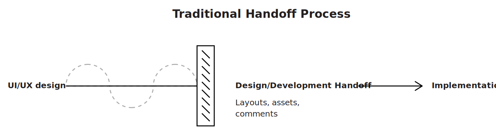

# Win Friends, not Battles

> _Any organization that designs a system will produce a design whose structure is a copy of the organization's communication structure._
>
>   __— Melvin E. Conway, ['Conway's law'](https://en.wikipedia.org/wiki/Conway%27s_law)

Whether we’re trying to [save bats](https://www.youtube.com/watch?v=_7Z7m6Fz_UA) or build design systems, winning friends will always prove a powerful strategy. Lean Design System promotes the idea of autonomous, empowered design system teams, where every individual strives to make their teammates' lifes easier and explores ways in which to optimize daily work. In the context of lean startups \(or resource-constrained organizations in general\), we can't afford to waste time on slow moving governance processes or wait for responses that got stuck in bottlenecks. We trace problems back to their source and rather pull up a \(real or virtual\) chair next to our colleagues than send an email, create a Jira issue, or even worse, tolerate the deficiency. Ideally, we always try to:

* …be catalysts of improvement
* …enable others
* …adopt and cultivate collective ownership
* …foster cross-functional collaboration

## Catalyze improvement

The [Theory of Constraints](https://en.wikipedia.org/wiki/Theory_of_constraints) teaches us that _"Any improvements made anywhere besides the bottleneck are an illusion"_ \(as summarized in [The Phoenix Project](https://itrevolution.com/the-phoenix-project/)\). We try to identify such any bottlenecks through the rigorous probing of every activity and interaction. Incremental development steps as proposed in [Minimum Viable Design System](minimum-viable-design-system.md) and [Steady Flow of Truth](../infrastructure/steady-flow-of-truth.md) allow us to reflect on our practices regularly and make changes as needed. This requires sufficient autonomy, however. In general, teams and individuals that  
  
Following this methodology, we become architects of exploration. We want to foster a culture of experimentation 

Kniberg wonderfully illustrates this idea in his Spotify video

A high autonomy, high alignment environment constitutes an ideal organizational hotbed for a naturally emerging design strategy. We value curiosity over defensiveness and the in helps us reflect our behaviors and decisions.

The juxtaposition illustrated in fig. 1 attempts to outline an ideal role model for people involved in the development of a lively and adaptive design system.

cross-pollination

## Adopt and cultivate collective ownership

## Foster cross-functional collaboration

## Where this tactic fits in











#### Authors and contributors

Daniel Kurfess

